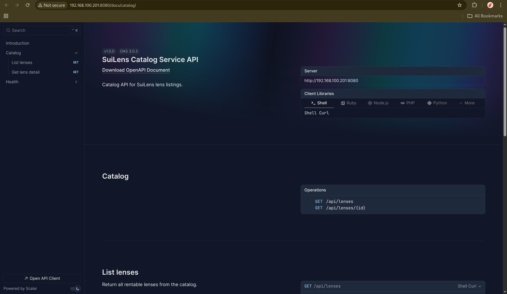
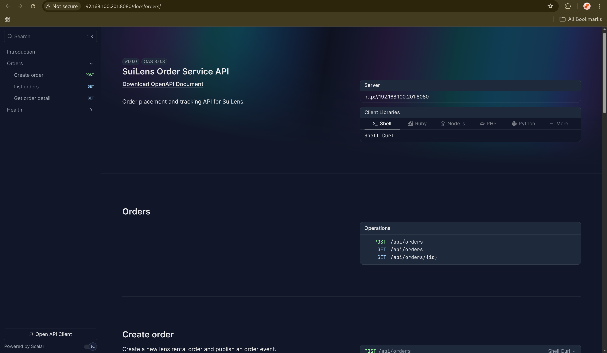
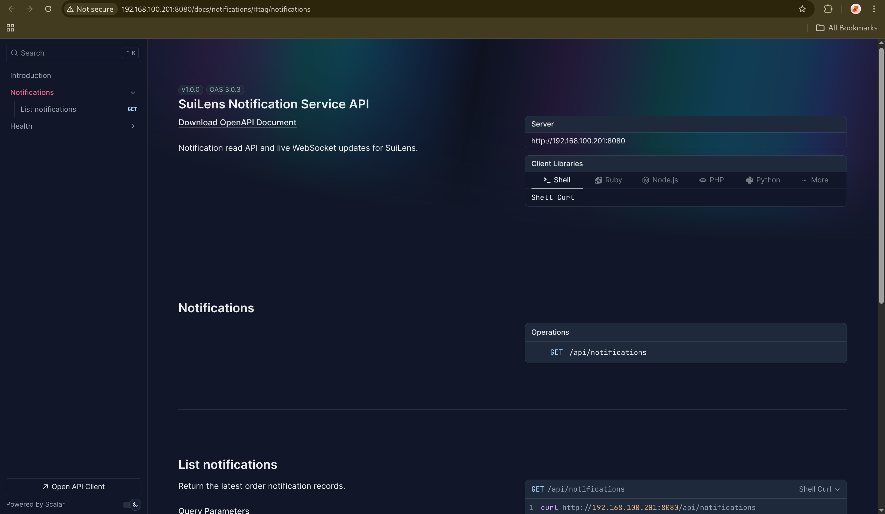
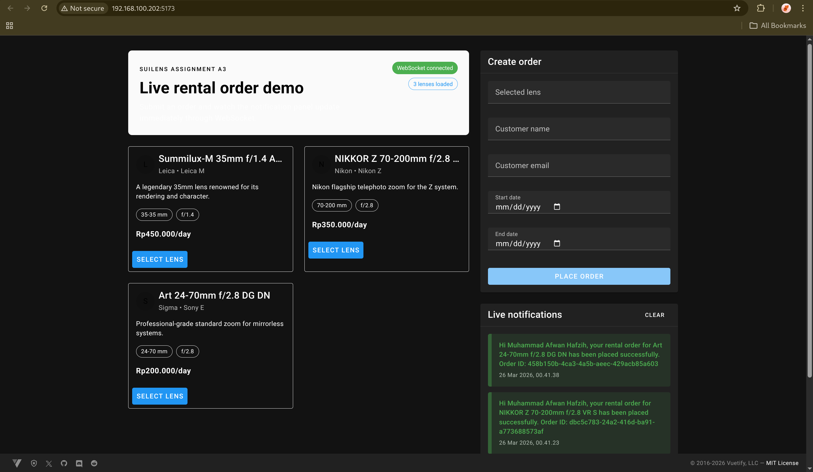
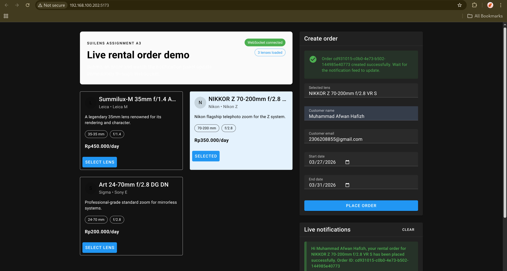
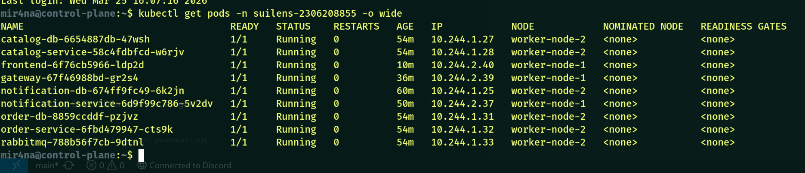

# Muhammad Afwan Hafzih
# NPM: 2306208855

# A3 SuiLens Assignment

SuiLens microservices assignment with:

- OpenAPI documentation for every backend service
- WebSocket-based live notifications on the frontend
- Docker Compose setup for local verification
- Kubernetes manifests for deployment to namespace `suilens-2306208855`

## Services

- `catalog-service`: lens catalog API and OpenAPI docs
- `order-service`: order creation API and OpenAPI docs
- `notification-service`: notification history API, WebSocket endpoint, and OpenAPI docs
- `gateway`: single entrypoint for frontend REST and WebSocket traffic
- `frontend`: order form and live notification dashboard

## Local Run

```bash
docker compose up --build -d
```

Application URLs:

- Frontend: `http://localhost:5173`
- Gateway: `http://localhost:8080`
- Catalog docs: `http://localhost:3001/docs`
- Order docs: `http://localhost:3002/docs`
- Notification docs: `http://localhost:3003/docs`
- Gateway docs proxy (catalog): `http://localhost:8080/docs/catalog`
- Gateway docs proxy (orders): `http://localhost:8080/docs/orders`
- Gateway docs proxy (notifications): `http://localhost:8080/docs/notifications`

## Smoke Test

```bash
curl http://localhost:8080/api/catalog/lenses | jq
LENS_ID=$(curl -s http://localhost:8080/api/catalog/lenses | jq -r '.[0].id')

curl -X POST http://localhost:8080/api/orders \
  -H "Content-Type: application/json" \
  -d '{
    "customerName": "Muhammad Afwan Hafzih",
    "customerEmail": "2306208855@gmail.com",
    "lensId": "'"$LENS_ID"'",
    "startDate": "2026-03-26",
    "endDate": "2026-03-29"
  }' | jq

curl "http://localhost:8080/api/notifications?limit=10" | jq
```

Expected result:

- frontend initially shows empty notification panel
- after POST order, notification panel updates automatically through WebSocket

## Docker Images

Docker Hub namespace: `mirananightfall`

Images to publish:

- `mirananightfall/a03-suilens-catalog`
- `mirananightfall/a03-suilens-order`
- `mirananightfall/a03-suilens-notification`
- `mirananightfall/a03-suilens-gateway`
- `mirananightfall/a03-suilens-frontend`

## Kubernetes Deployment

Namespace:

```bash
kubectl create namespace suilens-2306208855
```

Manifest directory:

```bash
k8s/
```

Deployment target:

- namespace `suilens-2306208855`
- `gateway` exposed as `LoadBalancer`
- `frontend` exposed as `LoadBalancer`
- backend services exposed internally as `ClusterIP`

## Screenshot Placeholders

- 
- 
- 
- 
- 
- 

## Submission Links

- `https://hub.docker.com/r/mirananightfall/a03-suilens-catalog`
- `https://hub.docker.com/r/mirananightfall/a03-suilens-order`
- `https://hub.docker.com/r/mirananightfall/a03-suilens-notification`
- `https://hub.docker.com/r/mirananightfall/a03-suilens-gateway`
- `https://hub.docker.com/r/mirananightfall/a03-suilens-frontend`